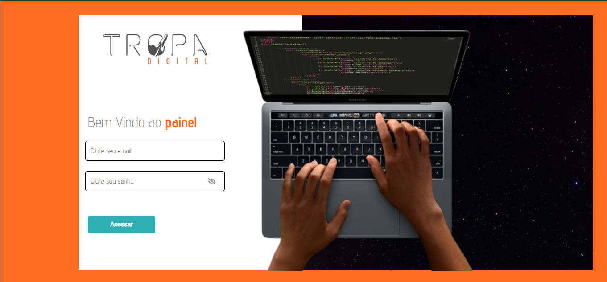
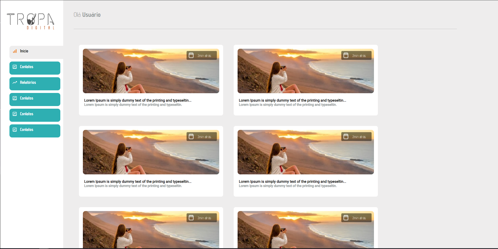

<a name="readme-top"></a>


<!-- PROJECT LOGO -->
<br />
<div align="center">
  <a>
    
  </a>
</div>


## Sobre o projeto

<div align="center">
  <br />
  <br />
  
</div>
<br />

<p>Clonar layout do figma, as 2 pages </p>
<p>Projeto deselvolvido para vaga frontend </p>

 <p align="center">
    <br />
    <a href="https://www.figma.com/proto/b5OjH4Ks6J8NKC4QqihbfR/Layout-Front-End-(Copy)?node-id=1%3A2&scaling=contain&page-id=0%3A1&starting-point-node-id=1%3A2">Demo do projeto</a>
  </p>


<p align="right">(<a href="#readme-top">back to top</a>)</p>


### Desenvolvido por :


<a href="https://reactjs.org/" target="_blank" rel="noreferrer">  


<p align="right">(<a href="#readme-top">back to top</a>)</p>


### Instalação


1. Clone do repo
   ```sh
   git clone https://github.com/ElvisFelix-dev/frontend-tropa-digital.git
   ```
   
2. Install NPM packages
   ```sh
   cd frontend-tropa-digital
   ```
3. Instalar NPM packages
   ```sh
   npm install
   ```
   
4. Iniciar
   ```sh
   npm run dev
   ```


<p align="right">(<a href="#readme-top">back to top</a>)</p>


